# VolunteerHub - High School Service Hours Platform

A comprehensive web application connecting high school volunteers with meaningful service opportunities to earn community service hours.

## Features

### For Volunteers
- Browse and filter volunteer opportunities
- Apply to positions with one click
- Track service hours automatically
- View application status and history
- Mobile-responsive dashboard

### For Organizations
- Post volunteer opportunities
- Manage applications and volunteers
- Track and verify completed hours
- Organization profile management
- Application review system

## User Guide

### For Organizations

#### Getting Started

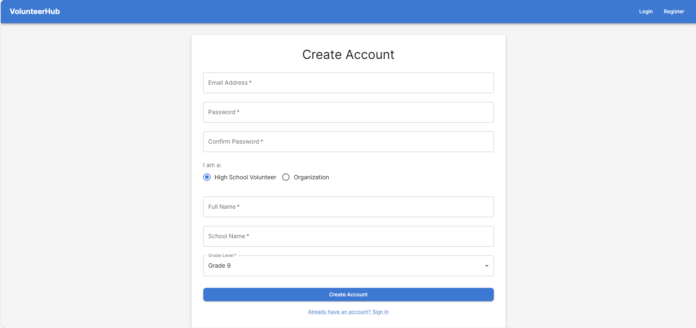

**Account Setup**  
Create an organization account by providing your organization details including organization name, description, website, and contact information. 

Once registered, complete your organization profile to help volunteers learn more about your mission and work. (TBD)

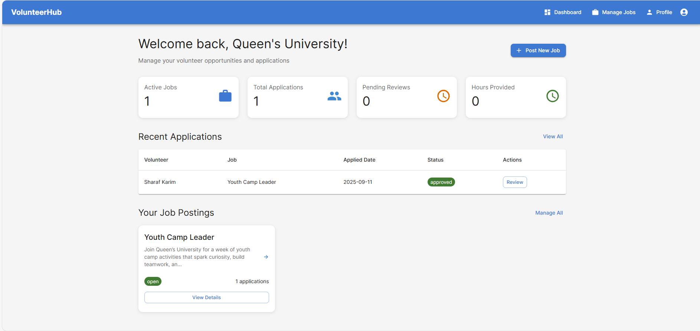

**Accessing Your Dashboard**
Navigate to your organization dashboard to manage all job postings, view applications, and track volunteer engagement. The dashboard provides an overview of active jobs, pending applications, and recent activity.

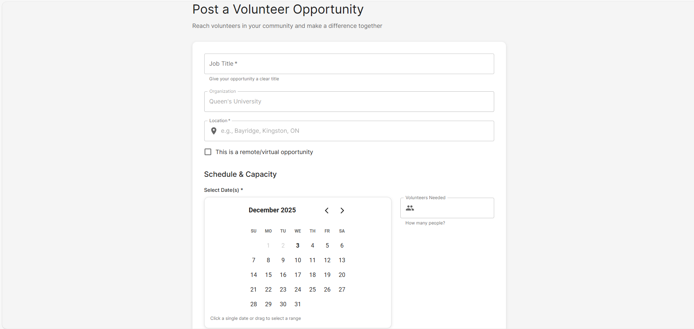
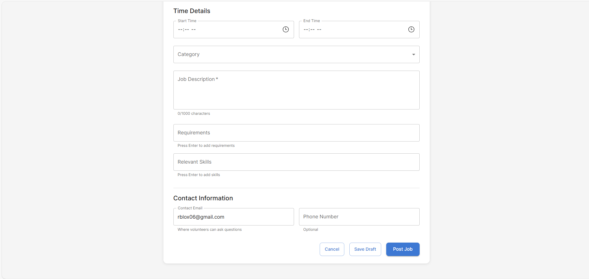

#### Creating Job Postings

**Basic Information**
1. Click "Post New Job" from your dashboard
2. Enter a clear, descriptive job title (e.g., "Youth Camp Volunteer")
3. Add your organization name (automatically filled from your profile)
4. Specify location or check "This is a remote/virtual opportunity"
5. Set date and time for the volunteer activity
6. Add duration (e.g., "3 hours", "Half day")
7. Specify number of volunteers needed

**Content and Details**
- Select appropriate category (Environment, Education, Healthcare, Community Service, Animal Welfare, Disaster Relief, Youth Programs, Senior Services, Food & Hunger, Other)
- Write a detailed job description explaining what volunteers will do and the impact they'll make
- Add requirements and skills section for any specific needs, age requirements, or what volunteers should bring
- Provide contact email for volunteer inquiries and optional phone number

**Publishing Options**
Choose job status:
- **Open**: Actively accepting applications
- **Closed**: No longer accepting new applications
- **Completed**: Volunteer activity has finished
- **Draft**: Job saved but not yet published

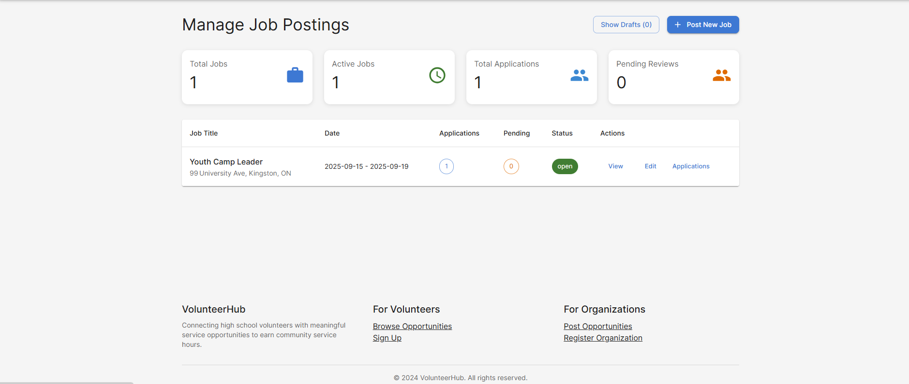

#### Managing Applications

**Viewing Applications**
1. Access "Manage Jobs" from your dashboard
2. Select any job to view received applications
3. Applications appear in the left sidebar with volunteer names and application dates
4. Click individual applications to view complete details including cover letter, availability dates, skills, references, and uploaded resumes

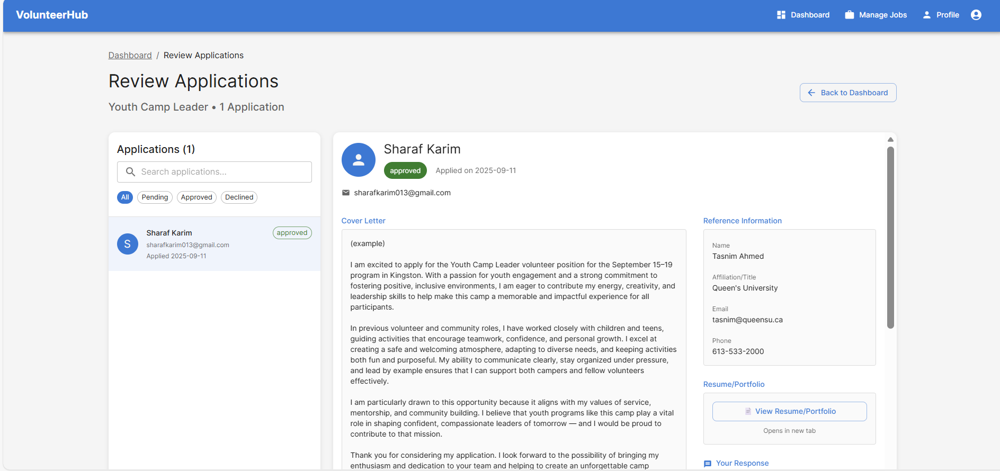

**Application Details Include**
- Volunteer contact information and profile
- Cover letter explaining their motivation
- Selected availability date range using calendar picker
- List of relevant skills entered by the volunteer
- Optional references with contact information
- Uploaded resume or portfolio (PDF, Word, JPG, or PNG format)

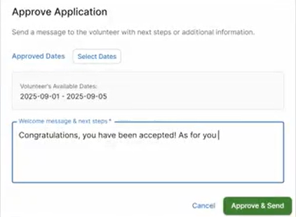

**Making Decisions**  
When reviewing applications, you can:

**Approve Applications**
1. Click "Approve" for qualified candidates
2. Select specific date ranges when the volunteer is approved to work
3. Add multiple separate date ranges for complex schedules (e.g., different weeks of a program)
4. Write a welcome message with next steps, arrival instructions, and contact details
5. System automatically sends email notification with approved dates and your message

**Decline Applications**
1. Click "Decline" with a respectful explanation
2. Provide constructive feedback when possible
3. Encourage future applications for other opportunities
4. System sends automatic email notification with your feedback

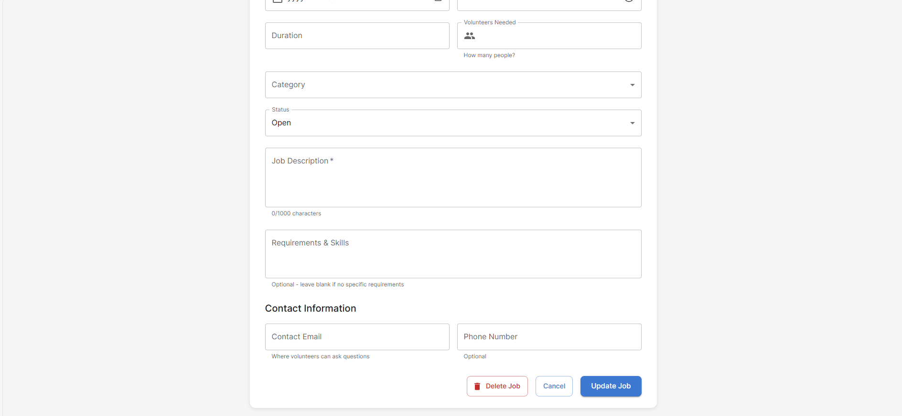

#### Job Management

**Editing Posted Jobs**
Access any published job to update:
- Job title, description, or requirements
- Date, time, or duration changes
- Location or remote status
- Number of volunteers needed
- Category classification
- Contact information
- Job status (Open, Closed, Completed, Draft)

**Deleting Jobs**
Use the delete function with caution as this permanently removes:
- The job posting
- All associated applications and data
- All volunteer application history for that position

Consider changing status to "Closed" instead if you want to stop accepting applications but preserve the posting.

---

### For Volunteers

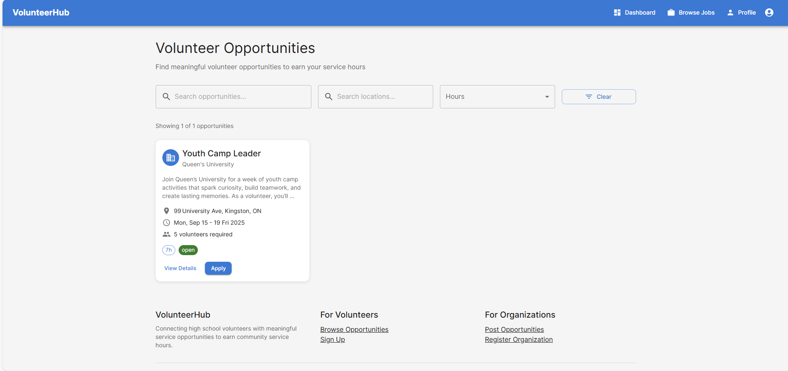

#### Finding Opportunities

**Browse Available Jobs**
View all current volunteer opportunities showing organization name, job title, location, date, and brief description. Each listing displays key information to help you identify suitable opportunities.

**Search and Filter**
- Filter by category (Environment, Education, Community Service, etc.)
- Search by location or find remote opportunities
- Filter by date range to match your availability
- Use keyword search for specific volunteer work types

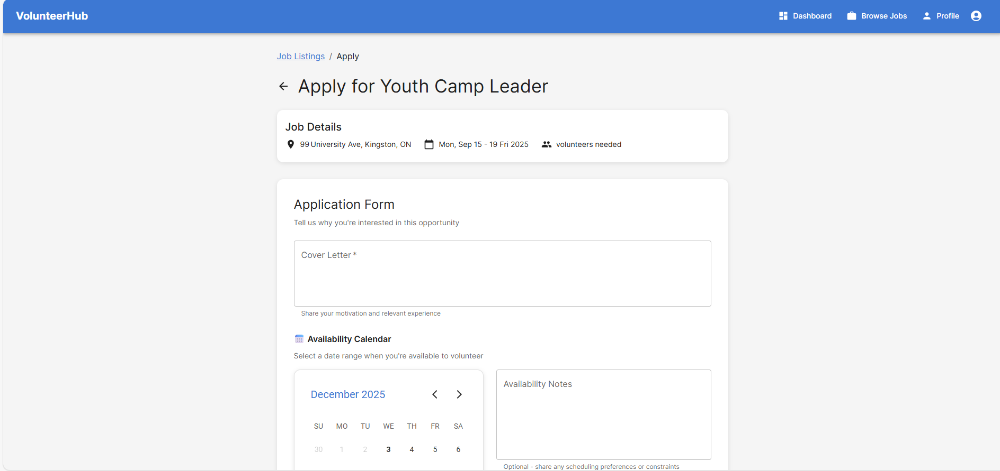
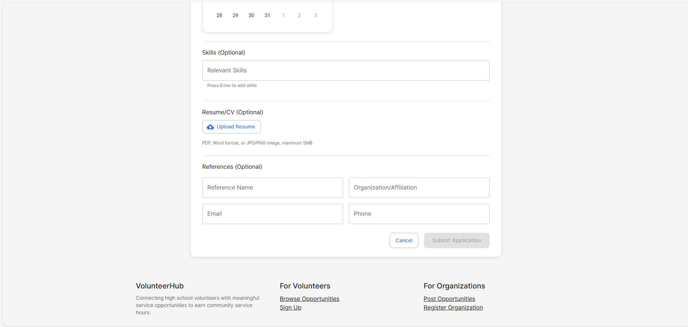

#### Creating Applications

**Application Components**

**Cover Letter**
Write a personalized message explaining your interest and relevant experience. This is your primary opportunity to show organizations why you're well-suited for their volunteer position.

**Availability Selection**
Use the interactive calendar to select your available date range:
- Click and drag to select single dates or date ranges
- Calendar prevents selection of past dates
- Your selected dates appear as connected highlights
- You can modify selections before submitting

**Skills Entry**
Add relevant skills using the dynamic entry system:
- Type a skill and press Enter to add it as a tag
- Skills appear as colored chips that can be removed individually
- Include both professional skills and personal interests relevant to the work
- System automatically formats skill names

**References (Optional)**
Provide contact information for someone who can speak to your character and reliability:
- Reference name
- Organization or affiliation
- Email address
- Phone number

**Resume Upload**
Upload supporting documents:
- Accepted formats: PDF, Word documents (.doc, .docx), images (JPG, PNG)
- Maximum file size: 5MB
- Files upload to secure cloud storage
- Organizations can view and download your materials

**Submitting Applications**
Review all sections before clicking "Submit Application". You'll receive confirmation of successful submission.

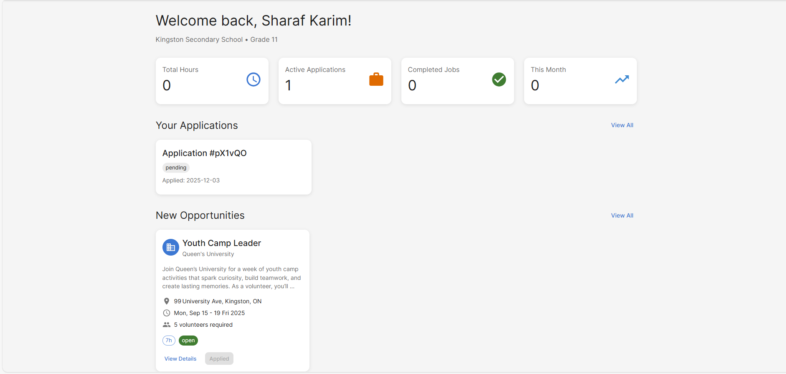

#### Application Status and Communication

**Status Tracking**
Monitor your applications through three status types:
- **Pending**: Organization is reviewing your application
- **Approved**: You've been selected with specific approved date ranges
- **Declined**: Organization selected other candidates

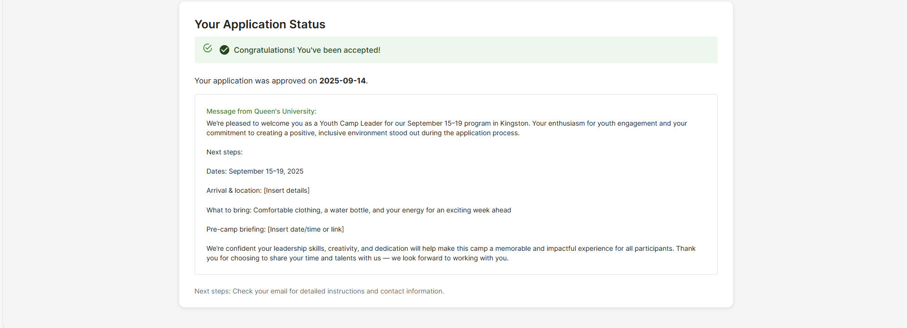

**Approved Applications**  
When approved, you receive:
- Specific date ranges you're approved to volunteer
- Welcome message from the organization
- Instructions for your first day
- Contact information for questions
- Email notification with all details

**Follow-up Communication**
Organizations may contact you directly for additional information. Maintain prompt communication and check email regularly for updates.

![Screenshot of Email Acceptance].(/assets/volunteer/email.png)

#### Application Best Practices

**Strong Cover Letters**
- Explain your specific interest in this organization's mission
- Mention relevant experience, including informal or personal experience
- Demonstrate genuine enthusiasm for the cause
- Keep content concise but meaningful

**Availability Planning**
- Select realistic date ranges considering your other commitments
- Account for travel time to volunteer locations
- Be flexible when possible to increase selection chances
- Consider the full scope of the volunteer commitment

**Professional Presentation**
- Keep skills list current and relevant to volunteer work
- Upload recent resume highlighting any volunteer or community experience
- Provide reliable references who can speak to your dependability
- Complete all application sections thoroughly

This platform facilitates meaningful connections between organizations and volunteers, helping create positive community impact through organized volunteer opportunities.

## Tech Stack

- **Frontend**: Next.js 14, React 18, TypeScript
- **UI Framework**: Material-UI v5
- **Authentication**: Firebase Auth
- **Database**: Firebase Firestore
- **Storage**: Firebase Storage
- **Calendar**: react-day-picker
- **Styling**: Tailwind CSS, Material-UI
- **Deployment**: Vercel/Firebase Hosting

## Developer Deployment Guide

This guide helps developers deploy the VolunteerHub platform to production environments.

### Pre-Deployment Checklist

- [ ] Firebase project created and configured
- [ ] Firebase Blaze plan enabled (required for Storage)
- [ ] Domain/hosting platform chosen
- [ ] Environment variables prepared
- [ ] Production database schema planned

### Firebase Setup for Production

#### 1. Create and Configure Firebase Project

1. Go to [Firebase Console](https://console.firebase.google.com)
2. Click "Create a project" or select existing project
3. Enable Google Analytics (recommended for production)
4. Note your project ID for later use

#### 2. Enable Required Services

**Authentication:**
```bash
# Enable Email/Password authentication
Firebase Console → Authentication → Sign-in method → Email/Password → Enable
```

**Firestore Database:**
```bash
# Create Firestore database
Firebase Console → Firestore Database → Create database → Start in production mode
```

**Storage:**
```bash
# Enable Firebase Storage
Firebase Console → Storage → Get started → Start in production mode
```

#### 3. Upgrade to Blaze Plan

**Required for file uploads and production usage:**
1. Go to Firebase Console → Project Settings → Usage and billing
2. Click "Modify plan"
3. Select "Blaze Plan" (pay-as-you-go)
4. Set up billing alerts (recommended: $10-20/month)

#### 4. Configure Security Rules

**Deploy Firestore Rules:**
```javascript
// firestore.rules
rules_version = '2';
service cloud.firestore {
  match /databases/{database}/documents {
    // Users can read/write their own profile
    match /users/{userId} {
      allow read, write: if request.auth != null && request.auth.uid == userId;
    }

    // Jobs are readable by all authenticated users
    // Only the organization that created the job can modify it
    match /jobs/{jobId} {
      allow read: if request.auth != null;
      allow create: if request.auth != null &&
        request.auth.uid == request.resource.data.organizationId;
      allow update, delete: if request.auth != null &&
        resource.data.organizationId == request.auth.uid;
    }

    // Applications can be read by volunteer or organization
    // Created by volunteers, updated by organizations
    match /applications/{applicationId} {
      allow read: if request.auth != null &&
        (resource.data.volunteerId == request.auth.uid ||
         get(/databases/$(database)/documents/jobs/$(resource.data.jobId)).data.organizationId == request.auth.uid);
      allow create: if request.auth != null &&
        request.auth.uid == request.resource.data.volunteerId;
      allow update: if request.auth != null &&
        get(/databases/$(database)/documents/jobs/$(resource.data.jobId)).data.organizationId == request.auth.uid;
    }
  }
}
```

**Deploy Storage Rules:**
```javascript
// storage.rules
rules_version = '2';
service firebase.storage {
  match /b/{bucket}/o {
    // Allow authenticated users to upload resumes to their own folder
    match /resumes/{userId}/{fileName} {
      allow read, write: if request.auth != null &&
        request.auth.uid == userId &&
        resource.size < 10 * 1024 * 1024; // 10MB limit
    }

    // Allow job-related file access
    match /jobs/{allPaths=**} {
      allow read: if request.auth != null;
      allow write: if request.auth != null;
    }
  }
}
```

**Deploy Rules via CLI:**
```bash
# Install Firebase CLI
npm install -g firebase-tools

# Login to Firebase
firebase login

# Initialize Firebase in your project
firebase init

# Deploy security rules
firebase deploy --only firestore:rules,storage
```

### Environment Configuration

#### Production Environment Variables

Create `.env.production` or configure in your hosting platform:

```bash
# Firebase Configuration
NEXT_PUBLIC_FIREBASE_API_KEY=your_production_api_key
NEXT_PUBLIC_FIREBASE_AUTH_DOMAIN=your-project.firebaseapp.com
NEXT_PUBLIC_FIREBASE_PROJECT_ID=your-project-id
NEXT_PUBLIC_FIREBASE_STORAGE_BUCKET=your-project.appspot.com
NEXT_PUBLIC_FIREBASE_MESSAGING_SENDER_ID=your_sender_id
NEXT_PUBLIC_FIREBASE_APP_ID=your_app_id

# Application Configuration
NEXT_PUBLIC_APP_URL=https://your-domain.com
NODE_ENV=production

# Optional: Analytics and Monitoring
NEXT_PUBLIC_GA_TRACKING_ID=your_ga_id
```

### Deployment Options

#### Option 1: Vercel Deployment (Recommended)

**Step 1: Prepare Repository**
```bash
# Ensure your code is pushed to GitHub/GitLab/Bitbucket
git add .
git commit -m "Prepare for production deployment"
git push origin main
```

**Step 2: Deploy via Vercel Dashboard**
1. Go to [vercel.com](https://vercel.com)
2. Click "New Project"
3. Import your repository
4. Configure environment variables in Vercel dashboard
5. Deploy

**Step 3: Configure Custom Domain (Optional)**
```bash
# In Vercel dashboard
Project Settings → Domains → Add custom domain
```

**Step 4: Verify Deployment**
- Test authentication flow
- Test job posting and application
- Test file uploads
- Check Firebase console for data

#### Option 2: Firebase Hosting

**Step 1: Build Application**
```bash
# Install dependencies and build
npm install
npm run build
```

**Step 2: Initialize Firebase Hosting**
```bash
firebase init hosting

# Select options:
# - Use existing project
# - Public directory: out (for static export) or .next (for server)
# - Configure as SPA: Yes
# - Set up automatic builds: No (manual for now)
```

**Step 3: Deploy**
```bash
firebase deploy --only hosting
```

#### Option 3: Custom Server Deployment

**For VPS/Dedicated Server:**

**Step 1: Server Setup**
```bash
# Install Node.js 18+
curl -fsSL https://deb.nodesource.com/setup_18.x | sudo -E bash -
sudo apt-get install -y nodejs

# Install PM2 for process management
npm install -g pm2
```

**Step 2: Application Setup**
```bash
# Clone repository
git clone your-repository-url /var/www/volunteerhub
cd /var/www/volunteerhub

# Install dependencies and build
npm install
npm run build

# Create PM2 ecosystem file
cat > ecosystem.config.js << EOF
module.exports = {
  apps: [{
    name: 'volunteerhub',
    script: 'npm',
    args: 'start',
    cwd: '/var/www/volunteerhub',
    env: {
      NODE_ENV: 'production',
      PORT: 3000
    }
  }]
}
EOF

# Start with PM2
pm2 start ecosystem.config.js
pm2 save
pm2 startup
```

**Step 3: Nginx Configuration**
```nginx
# /etc/nginx/sites-available/volunteerhub
server {
    listen 80;
    server_name your-domain.com;

    location / {
        proxy_pass http://localhost:3000;
        proxy_http_version 1.1;
        proxy_set_header Upgrade $http_upgrade;
        proxy_set_header Connection 'upgrade';
        proxy_set_header Host $host;
        proxy_set_header X-Real-IP $remote_addr;
        proxy_set_header X-Forwarded-For $proxy_add_x_forwarded_for;
        proxy_set_header X-Forwarded-Proto $scheme;
        proxy_cache_bypass $http_upgrade;
    }
}
```

### Post-Deployment Setup

#### 1. Database Indexing

Create Firestore indexes for better performance:

```bash
# Firebase will prompt to create indexes when needed
# Or create manually in Firebase Console → Firestore → Indexes
```

**Common indexes needed:**
- `jobs` collection: `organizationId`, `status`, `createdAt`
- `applications` collection: `jobId`, `volunteerId`, `status`
- `users` collection: `role`, `createdAt`

#### 2. Initial Data Setup

**Create first admin/organization user:**
```typescript
// Run this script once after deployment
// scripts/create-admin.ts
import { createUserWithEmailAndPassword } from 'firebase/auth'
import { doc, setDoc } from 'firebase/firestore'
import { auth, db } from './lib/firebase'

const createInitialAdmin = async () => {
  try {
    const userCredential = await createUserWithEmailAndPassword(
      auth,
      'admin@yourdomain.com',
      'your-secure-password'
    )

    await setDoc(doc(db, 'users', userCredential.user.uid), {
      email: 'admin@yourdomain.com',
      role: 'organization',
      organizationName: 'Your Organization',
      createdAt: new Date(),
    })

    console.log('Admin user created successfully')
  } catch (error) {
    console.error('Error creating admin:', error)
  }
}
```

#### 3. Monitoring and Analytics

**Set up error monitoring:**
```bash
# Install Sentry (optional)
npm install @sentry/nextjs

# Configure in next.config.js
```

**Firebase Performance Monitoring:**
```typescript
// lib/firebase.ts
import { getPerformance } from 'firebase/performance'

if (typeof window !== 'undefined') {
  const perf = getPerformance(app)
}
```

### Production Optimization

#### 1. Performance Optimizations

**Image Optimization:**
```typescript
// next.config.js
/** @type {import('next').NextConfig} */
const nextConfig = {
  images: {
    domains: ['firebasestorage.googleapis.com'],
    formats: ['image/webp', 'image/avif'],
  },
  experimental: {
    optimizeCss: true,
  }
}
```

**Bundle Analysis:**
```bash
npm install --save-dev @next/bundle-analyzer

# Add to package.json
"analyze": "ANALYZE=true next build"

npm run analyze
```

#### 2. Security Hardening

**Content Security Policy:**
```typescript
// next.config.js
const nextConfig = {
  async headers() {
    return [
      {
        source: '/:path*',
        headers: [
          {
            key: 'X-Frame-Options',
            value: 'DENY',
          },
          {
            key: 'X-Content-Type-Options',
            value: 'nosniff',
          },
          {
            key: 'Referrer-Policy',
            value: 'origin-when-cross-origin',
          },
        ],
      },
    ]
  },
}
```

#### 3. Backup Strategy

**Automated Firestore Backups:**
```bash
# Set up in Firebase Console
# Firestore → Backups → Schedule backups
# Recommended: Daily backups, 30-day retention
```

### Troubleshooting Common Issues

#### Firebase Quota Issues
- **Solution**: Monitor usage in Firebase Console, optimize queries
- **Prevention**: Implement pagination, caching

#### Vercel Function Timeout
- **Solution**: Optimize Firebase queries, use Edge runtime where possible
- **Code**: Add `export const runtime = 'edge'` to API routes

#### Storage Upload Failures
- **Check**: Firebase Storage rules, file size limits, user authentication
- **Debug**: Enable Firebase debug logging

#### Build Failures
```bash
# Common fixes
rm -rf .next node_modules
npm install
npm run build

# Check for TypeScript errors
npx tsc --noEmit
```

### Maintenance

#### Regular Tasks
- **Weekly**: Monitor Firebase usage and costs
- **Monthly**: Review and clean up old applications/jobs
- **Quarterly**: Update dependencies and security patches

#### Update Process
```bash
# Update dependencies
npm update
npm audit fix

# Test locally
npm run dev

# Deploy updates
git push origin main  # (triggers auto-deploy on Vercel)
```

This deployment guide ensures your VolunteerHub platform runs reliably in production with proper security, performance, and monitoring in place.
- **Storage**: Firebase Storage
- **Deployment**: Vercel (recommended)

## Getting Started

### Prerequisites
- Node.js 18+
- npm or yarn
- Firebase project

### Installation

1. Clone the repository:
\`\`\`bash
git clone <repository-url>
cd volunteer-platform
\`\`\`

2. Install dependencies:
\`\`\`bash
npm install
\`\`\`

3. Set up Firebase:
   - Create a new Firebase project at https://console.firebase.google.com
   - Enable Authentication (Email/Password)
   - Create a Firestore database
   - Get your Firebase configuration

4. Environment setup:
\`\`\`bash
cp .env.example .env.local
\`\`\`

Fill in your Firebase configuration in `.env.local`:
\`\`\`
NEXT_PUBLIC_FIREBASE_API_KEY=your_api_key
NEXT_PUBLIC_FIREBASE_AUTH_DOMAIN=your_project.firebaseapp.com
NEXT_PUBLIC_FIREBASE_PROJECT_ID=your_project_id
NEXT_PUBLIC_FIREBASE_STORAGE_BUCKET=your_project.appspot.com
NEXT_PUBLIC_FIREBASE_MESSAGING_SENDER_ID=your_sender_id
NEXT_PUBLIC_FIREBASE_APP_ID=your_app_id
\`\`\`

5. Run the development server:
\`\`\`bash
npm run dev
\`\`\`

Open [http://localhost:3000](http://localhost:3000) to view the application.

## Firebase Security Rules

### Firestore Rules
\`\`\`javascript
rules_version = '2';
service cloud.firestore {
  match /databases/{database}/documents {
    // Users can read/write their own profile
    match /users/{userId} {
      allow read, write: if request.auth != null && request.auth.uid == userId;
    }

    // Jobs are readable by all authenticated users
    match /jobs/{jobId} {
      allow read: if request.auth != null;
      allow write: if request.auth != null &&
        (resource == null || resource.data.organizationId == request.auth.uid);
    }

    // Applications
    match /applications/{applicationId} {
      allow read: if request.auth != null &&
        (resource.data.volunteerId == request.auth.uid ||
         resource.data.organizationId == request.auth.uid);
      allow create: if request.auth != null &&
        request.auth.uid == resource.data.volunteerId;
      allow update: if request.auth != null &&
        resource.data.organizationId == request.auth.uid;
    }
  }
}
\`\`\`

### Storage Rules
\`\`\`javascript
rules_version = '2';
service firebase.storage {
  match /b/{bucket}/o {
    match /{allPaths=**} {
      allow read, write: if request.auth != null;
    }
  }
}
\`\`\`

## Deployment

### Deploy to Vercel

1. Install Vercel CLI:
\`\`\`bash
npm i -g vercel
\`\`\`

2. Deploy:
\`\`\`bash
vercel
\`\`\`

3. Set environment variables in Vercel dashboard

### Deploy to Firebase Hosting

1. Install Firebase CLI:
\`\`\`bash
npm install -g firebase-tools
\`\`\`

2. Login and initialize:
\`\`\`bash
firebase login
firebase init hosting
\`\`\`

3. Build and deploy:
\`\`\`bash
npm run build
firebase deploy
\`\`\`

## Project Structure

\`\`\`
volunteer-platform/
├── app/                          # Next.js app directory
│   ├── layout.tsx               # Root layout
│   ├── page.tsx                 # Home page
│   ├── login/                   # Authentication pages
│   ├── register/
│   ├── volunteer/               # Volunteer-specific pages
│   │   ├── dashboard/
│   │   ├── jobs/
│   │   └── profile/
│   └── organization/            # Organization-specific pages
│       ├── dashboard/
│       ├── jobs/
│       └── profile/
├── components/                   # Reusable components
│   ├── Layout/                  # Layout components
│   ├── UI/                      # UI components
│   └── ProtectedRoute.tsx       # Route protection
├── contexts/                     # React contexts
│   └── AuthContext.tsx          # Authentication context
├── lib/                         # Utilities and configuration
│   ├── firebase.ts              # Firebase configuration
│   ├── types.ts                 # TypeScript types
│   └── theme.ts                 # Material-UI theme
└── public/                      # Static assets
\`\`\`

## Contributing

1. Fork the repository
2. Create a feature branch
3. Make your changes
4. Add tests if applicable
5. Submit a pull request

## License

This project is licensed under the MIT License.
